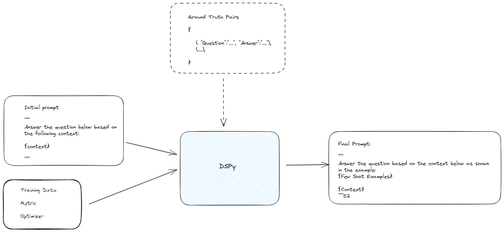
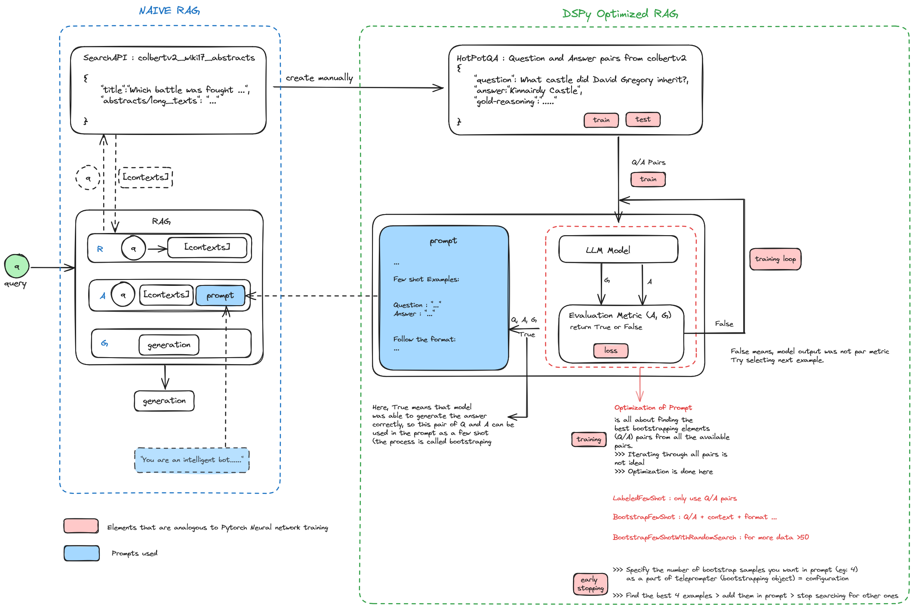

## DSPy - Declaring Self Improving Language Programs Pythonically


### Introduction and the need for DSPy

DSPy is a framework for developing and optimizing LLM programs rather than manually tweaking prompts.

A solution to a single application/usecase with an LLM is not solved by training/prompting the model to solve the entire problem at once (giving the whole input) and expecting an output but rather is solved by breaking the program into multiple sub problems and then asking the LLMs to solve each like divide and conquer.

**While doing so, there will be some fuzzy steps (not hard coded steps) that are not standard or not well defined, but affects the output of the model like prompts. Now, getting out of toy example, the models trying to solve real world examples are very sensitive to prompts.**

So, we have DSPy that deals with optimizations these fuzzy steps given a model & given a usecase/problem statement. The core idea is to program - not prompting language models.




In DSPy, we dont write and tweak brittle prompts rather we write a short langauge program in python that designs a prompt to use LM effectively. This means that we are compiling a python code (here: high level langauge) to a natural language (here: low level language).

So, there are two running ideas in DSPy:
1. We seperate the program logic (executable modules) from how a language model is taught to produce an output
2. We optimize how the LMs are prompted (or finetuned) via discrete search over modular language elements. 

> _DSPy is a framework for algorithmically optimizing LM prompts and weights, especially when LMs are used one or more times within a pipeline. To use LMs to build a complex system without DSPy, you generally have to: (1) break the problem down into steps, (2) prompt your LM well until each step works well in isolation, (3) tweak the steps to work well together, (4) generate synthetic examples to tune each step, and (5) use these examples to finetune smaller LMs to cut costs. Currently, this is hard and messy: every time you change your pipeline, your LM, or your data, all prompts (or finetuning steps) may need to change._

Existing LM pipelines are modular in principle (like with modular RAGs), but extremely messy and ad-hoc in practice because these fuzzy steps are one of the key factors in development and it differs for every model >> because instruction tuning of the model might have occured in different ways, the system context might have been configured in different ways (config layer of LLMs) and more. 

**It is not always sure that having a better prompt for a model does not mean it will work better for other different models available.** >> Why is this the case? :: Because models don't learn the english that we do, a subtle change in the language wording makes a big difference to their understanding and effeectiveness.


For example:

Maybe a simple answer the question based on a given context works for GPT4 becuase its intelligent enough (and massively trained) but if you are working with open-source llms (while are still dragging behind) you might want to give it some examples (few shots) for it to perform better. ***This means that we are solving the same problem but needs different prompts that gives three different results.**

## Working and Understanding DSPy

DSPy introduces signatures (to abstract prompts), modules (to abstract prompting techniques), and optimizers that can tune the prompts (or weights) of modules.

1. Signatures


>_A signature is a declarative specification of input/output behavior of a DSPy module. Signatures allow you to tell the LM what it needs to do, rather than specify how we should ask the LM to do it._

Examples of signatures:
-  question -> reasoning, answer
-  document -> summary
-  context, question -> search_query
-  question, context -> reasoning, answer

The DSPy compiler will figure out how to build a highly-optimized prompt for your LM (or finetune your small LM) for your signature, on your data, and within your pipeline. 



_Figure 2: Understanding of DSPy with comparison of Pytorch_

2. Optimizations

>_An optimizer is an algorithm that can tune DSPy program parameters (i.e., the prompts in our cases here, but can be LMs weights as well) to maximize a certain evaluation metrics, like accuracy._

Optimization problem is : Take this program (flow of the program), here are 20 questions and its answers, metric is : does the answer match ? :: find me the best prompt that helps me get that.


So, Keep a record of which and what prompt worked in the past, and use that prompt for generation (as few shots) >>> Generate >>> filter (discrete search) >>> use >>> The only problem becomes how to not do all the combination >>> Optimize

Inner workings of optimizations:

1. For given questions and answer pairs, pass it through the model >>> Run the pair through your pipeline
2. Keep a record of the traces (Q/A pairs) that perform good in the evaluation metric >> acheive high quality
3. Use those pairs as a few shot examples to see if it works well or not? Find the traces that works well : Optimization
4. The core optimization is : how not to go through all the traces combination, rather select the most effective ones? >> Selecting from a discrete set of examples pairs >> Discrete Optimization

### Analogy to a Neural network training


> When we build neural networks, we don't write manual for-loops over lists of hand-tuned floats. Instead, you might use a framework like PyTorch to compose layers (e.g., Convolution or Dropout) and then use optimizers (e.g., SGD or Adam) to learn the parameters of the network.


TLDR;

The idea is not to write chain of thought in prompt but to rather use a module that already has the COT like langchainhub and optimize the prompt based on your dataset.

### An approach to RAG system with DSPy


```python
import dspy
import os

# ENVIRONMENTS
from dotenv import load_dotenv
load_dotenv("./.env")


# Wrap the AzureOpenAI LLM using DSPy
turbo = dspy.AzureOpenAI(
    api_key=os.environ["AZURE_OPENAI_API_KEY"],
    api_base=os.environ["AZURE_ENDPOINT"],
    api_version=os.environ["OPENAI_API_VERSION"],
    deployment_id = os.environ["DEPLOYMENT_NAME"],
    max_tokens=250
    )

# Original Dataset / Dataset in which we are expected to retreive and provide context from
# RAG document source
colbertv2_wiki17_abstracts = dspy.ColBERTv2(url='http://20.102.90.50:2017/wiki17_abstracts')

dspy.settings.configure(lm=turbo, rm=colbertv2_wiki17_abstracts)
# lm = Language Model
# rm = Retreival Model (but we are going to use our own retreival approach)
```

**An example of a single entry in colbertv2_wiki17_abstracts**
```
{
    'text': 'David (commentator) | David (Greek: Δαυΐδ ; fl. 6th century) was a Greek scholar and a commentator on Aristotle and Porphyry.', 
    'pid': 4948591, 
    'rank': 1, 
    'score': 27.326705932617188, 
    'prob': 0.296344890368164, 
    'long_text': 'David (commentator) | David (Greek: Δαυΐδ ; fl. 6th century) was a Greek scholar and a commentator on Aristotle and Porphyry.'
    }
```

We also have a HotPotQA dataset that contains QA pairs to perform complex reasoning and provide explanations for answers. This dataset is designed to evaluate LMs on its generation task.


```python
from dspy.datasets import HotPotQA

# Load the dataset.
dataset = HotPotQA(train_seed=1, train_size=20, eval_seed=2023, dev_size=50, test_size=0)

# Tell DSPy that the 'question' field is the input. Any other fields are labels and/or metadata.
trainset = [x.with_inputs('question') for x in dataset.train]
devset = [x.with_inputs('question') for x in dataset.dev]
```

**An example of a train data in HotPotQA is:**


```python
dataset.train[0]
```


    Example({'question': 'At My Window was released by which American singer-songwriter?', 'answer': 'John Townes Van Zandt'}) (input_keys=None)


**An example of a train data in HotPotQA is:**


```python
dataset.dev[0]
```


    Example({'question': 'Are both Cangzhou and Qionghai in the Hebei province of China?', 'answer': 'no', 'gold_titles': {'Qionghai', 'Cangzhou'}}) (input_keys=None)


We will now create a retreival method that is supposed to replicate the retreival mechanism in a RAG system.

This `retreival` method given a query, provides that topk results from an API endpoint.


```python
import requests

def retreive(query):
    print("---RETREIVAL---")
    # Given a query string, get the top 5 most similar abstracts to query
    payload = {"query": query, "k": 5}

    # source endpoint
    url='http://20.102.90.50:2017/wiki17_abstracts'
    
    # request
    res = requests.get(url, params=payload, timeout=10)

    # topk filtering
    topk = res.json()["topk"][:5]
    topk = [{**d, "long_text": d["text"]} for d in topk]

    # context creation    
    contexts = [" ".join([k["text"], k["long_text"]]) for k in topk]
    
    return contexts
```

Now that we have our retreival method ready, we will start creating the DSPy program.

We will start by designing a signature : `context, question -> answer` , that takes in a context and a question to provide an answer.


```python
class GenerateAnswer(dspy.Signature):
    """Answer questions with short factoid answers."""
    context = dspy.InputField(desc="may contain relevant facts")
    question = dspy.InputField()
    answer = dspy.OutputField(desc="often between 1 and 5 words")
```


```python
class RAG(dspy.Module):
    def __init__(self, num_passages=3):
        super().__init__()
        # Retreival model using DSPy
        # self.retrieve = dspy.Retrieve(k=num_passages)

        # Apply Chain of Thought while generating the answer
        # This basically means, the prompt will be designed in a CoT manner that takes in the context, question -> answer
        # To understand this refer to the generated prompt in the coming blocks
        self.generate_answer = dspy.ChainOfThought(GenerateAnswer)
    
    def forward(self, question):
        # context = self.retrieve(question).passages
        # we will not follow the DSPy way of retreival but rather have our own retreival approach
        # The general idea remains tha same        
        context = retreive(question)

        # generate the prediction
        print("---GENERATION---")
        prediction = self.generate_answer(context=context, question=question)

        # return an object of Prediction
        return dspy.Prediction(context=context, answer=prediction.answer)
```

We now have a RAG system in DSPy that takes in a question, retreives contexts and generates the answer. Let us make a invocation (if you are coming from langchain) or call the model (if you are coming from training a deep neural network in Pytorch).


```python
# Lets take a toy question and pass it through our RAG system to get the answer
TOY_QUERY = "What castle did David Gregory inherit?"

RAG().forward(question=TOY_QUERY).answer
```

    ---RETREIVAL---
    ---GENERATION---


    'Kinnairdy Castle'


```python
# To see the context for the generation we have:
RAG().forward(question=TOY_QUERY).context
```

    ---RETREIVAL---
    ---GENERATION---


    ['David Gregory (physician) | David Gregory (20 December 1625 – 1720) was a Scottish physician and inventor. His surname is sometimes spelt as Gregorie, the original Scottish spelling. He inherited Kinnairdy Castle in 1664. Three of his twenty-nine children became mathematics professors. He is credited with inventing a military cannon that Isaac Newton described as "being destructive to the human species". Copies and details of the model no longer exist. Gregory\'s use of a barometer to predict farming-related weather conditions led him to be accused of witchcraft by Presbyterian ministers from Aberdeen, although he was never convicted. David Gregory (physician) | David Gregory (20 December 1625 – 1720) was a Scottish physician and inventor. His surname is sometimes spelt as Gregorie, the original Scottish spelling. He inherited Kinnairdy Castle in 1664. Three of his twenty-nine children became mathematics professors. He is credited with inventing a military cannon that Isaac Newton described as "being destructive to the human species". Copies and details of the model no longer exist. Gregory\'s use of a barometer to predict farming-related weather conditions led him to be accused of witchcraft by Presbyterian ministers from Aberdeen, although he was never convicted.',
     'Gregory Tarchaneiotes | Gregory Tarchaneiotes (Greek: Γρηγόριος Ταρχανειώτης , Italian: "Gregorio Tracanioto" or "Tracamoto" ) was a "protospatharius" and the long-reigning catepan of Italy from 998 to 1006. In December 999, and again on February 2, 1002, he reinstituted and confirmed the possessions of the abbey and monks of Monte Cassino in Ascoli. In 1004, he fortified and expanded the castle of Dragonara on the Fortore. He gave it three circular towers and one square one. He also strengthened Lucera. Gregory Tarchaneiotes | Gregory Tarchaneiotes (Greek: Γρηγόριος Ταρχανειώτης , Italian: "Gregorio Tracanioto" or "Tracamoto" ) was a "protospatharius" and the long-reigning catepan of Italy from 998 to 1006. In December 999, and again on February 2, 1002, he reinstituted and confirmed the possessions of the abbey and monks of Monte Cassino in Ascoli. In 1004, he fortified and expanded the castle of Dragonara on the Fortore. He gave it three circular towers and one square one. He also strengthened Lucera.',
     'David Gregory (mathematician) | David Gregory (originally spelt Gregorie) FRS (? 1659 – 10 October 1708) was a Scottish mathematician and astronomer. He was professor of mathematics at the University of Edinburgh, Savilian Professor of Astronomy at the University of Oxford, and a commentator on Isaac Newton\'s "Principia". David Gregory (mathematician) | David Gregory (originally spelt Gregorie) FRS (? 1659 – 10 October 1708) was a Scottish mathematician and astronomer. He was professor of mathematics at the University of Edinburgh, Savilian Professor of Astronomy at the University of Oxford, and a commentator on Isaac Newton\'s "Principia".',
     'David Gregory (historian) | David Gregory (1696–1767) was an English churchman and academic, Dean of Christ Church, Oxford and the first Regius Professor of Modern History at Oxford. David Gregory (historian) | David Gregory (1696–1767) was an English churchman and academic, Dean of Christ Church, Oxford and the first Regius Professor of Modern History at Oxford.',
     'Gregory of Gaeta | Gregory was the Duke of Gaeta from 963 until his death. He was the second son of Docibilis II of Gaeta and his wife Orania. He succeeded his brother John II, who had left only daughters. Gregory rapidly depleted the "publicum" (public land) of the Duchy of Gaeta by doling it out to family members as grants. Gregory disappears from the records in 964 and was succeeded by his younger brother Marinus of Fondi over the heads of his three sons. It is possible that there was an internal power struggle between factions of the Docibilan family and that Gregory was forced out. On the other hand, perhaps he died and his sons fought a losing battle for their inheritance to Gaeta. Gregory of Gaeta | Gregory was the Duke of Gaeta from 963 until his death. He was the second son of Docibilis II of Gaeta and his wife Orania. He succeeded his brother John II, who had left only daughters. Gregory rapidly depleted the "publicum" (public land) of the Duchy of Gaeta by doling it out to family members as grants. Gregory disappears from the records in 964 and was succeeded by his younger brother Marinus of Fondi over the heads of his three sons. It is possible that there was an internal power struggle between factions of the Docibilan family and that Gregory was forced out. On the other hand, perhaps he died and his sons fought a losing battle for their inheritance to Gaeta.']


Did you just see what happened? For those who are familiar to a RAG application or ones who create LLM based application, we never wrote any prompt. Did we? yes we didn't. Then how did the LLM generate the response and a perfect response for that matter.

This is where DSPy is doing wonders, it created a prompt on its own based on the following program:
```
self.generate_answer = dspy.ChainOfThought(GenerateAnswer)
```

But it is impirical for an LLM to have a prompt, where is out prompt then? lets take a look into it:


```python
turbo.inspect_history(n=1)
```

    
    
    
    
    Answer questions with short factoid answers.
    
    ---
    
    Follow the following format.
    
    Context: may contain relevant facts
    
    Question: ${question}
    
    Reasoning: Let's think step by step in order to ${produce the answer}. We ...
    
    Answer: often between 1 and 5 words
    
    ---
    
    Context:
    [1] «David Gregory (physician) | David Gregory (20 December 1625 – 1720) was a Scottish physician and inventor. His surname is sometimes spelt as Gregorie, the original Scottish spelling. He inherited Kinnairdy Castle in 1664. Three of his twenty-nine children became mathematics professors. He is credited with inventing a military cannon that Isaac Newton described as "being destructive to the human species". Copies and details of the model no longer exist. Gregory's use of a barometer to predict farming-related weather conditions led him to be accused of witchcraft by Presbyterian ministers from Aberdeen, although he was never convicted. David Gregory (physician) | David Gregory (20 December 1625 – 1720) was a Scottish physician and inventor. His surname is sometimes spelt as Gregorie, the original Scottish spelling. He inherited Kinnairdy Castle in 1664. Three of his twenty-nine children became mathematics professors. He is credited with inventing a military cannon that Isaac Newton described as "being destructive to the human species". Copies and details of the model no longer exist. Gregory's use of a barometer to predict farming-related weather conditions led him to be accused of witchcraft by Presbyterian ministers from Aberdeen, although he was never convicted.»
    [2] «Gregory Tarchaneiotes | Gregory Tarchaneiotes (Greek: Γρηγόριος Ταρχανειώτης , Italian: "Gregorio Tracanioto" or "Tracamoto" ) was a "protospatharius" and the long-reigning catepan of Italy from 998 to 1006. In December 999, and again on February 2, 1002, he reinstituted and confirmed the possessions of the abbey and monks of Monte Cassino in Ascoli. In 1004, he fortified and expanded the castle of Dragonara on the Fortore. He gave it three circular towers and one square one. He also strengthened Lucera. Gregory Tarchaneiotes | Gregory Tarchaneiotes (Greek: Γρηγόριος Ταρχανειώτης , Italian: "Gregorio Tracanioto" or "Tracamoto" ) was a "protospatharius" and the long-reigning catepan of Italy from 998 to 1006. In December 999, and again on February 2, 1002, he reinstituted and confirmed the possessions of the abbey and monks of Monte Cassino in Ascoli. In 1004, he fortified and expanded the castle of Dragonara on the Fortore. He gave it three circular towers and one square one. He also strengthened Lucera.»
    [3] «David Gregory (mathematician) | David Gregory (originally spelt Gregorie) FRS (? 1659 – 10 October 1708) was a Scottish mathematician and astronomer. He was professor of mathematics at the University of Edinburgh, Savilian Professor of Astronomy at the University of Oxford, and a commentator on Isaac Newton's "Principia". David Gregory (mathematician) | David Gregory (originally spelt Gregorie) FRS (? 1659 – 10 October 1708) was a Scottish mathematician and astronomer. He was professor of mathematics at the University of Edinburgh, Savilian Professor of Astronomy at the University of Oxford, and a commentator on Isaac Newton's "Principia".»
    [4] «David Gregory (historian) | David Gregory (1696–1767) was an English churchman and academic, Dean of Christ Church, Oxford and the first Regius Professor of Modern History at Oxford. David Gregory (historian) | David Gregory (1696–1767) was an English churchman and academic, Dean of Christ Church, Oxford and the first Regius Professor of Modern History at Oxford.»
    [5] «Gregory of Gaeta | Gregory was the Duke of Gaeta from 963 until his death. He was the second son of Docibilis II of Gaeta and his wife Orania. He succeeded his brother John II, who had left only daughters. Gregory rapidly depleted the "publicum" (public land) of the Duchy of Gaeta by doling it out to family members as grants. Gregory disappears from the records in 964 and was succeeded by his younger brother Marinus of Fondi over the heads of his three sons. It is possible that there was an internal power struggle between factions of the Docibilan family and that Gregory was forced out. On the other hand, perhaps he died and his sons fought a losing battle for their inheritance to Gaeta. Gregory of Gaeta | Gregory was the Duke of Gaeta from 963 until his death. He was the second son of Docibilis II of Gaeta and his wife Orania. He succeeded his brother John II, who had left only daughters. Gregory rapidly depleted the "publicum" (public land) of the Duchy of Gaeta by doling it out to family members as grants. Gregory disappears from the records in 964 and was succeeded by his younger brother Marinus of Fondi over the heads of his three sons. It is possible that there was an internal power struggle between factions of the Docibilan family and that Gregory was forced out. On the other hand, perhaps he died and his sons fought a losing battle for their inheritance to Gaeta.»
    
    Question: What castle did David Gregory inherit?
    
    Reasoning: Let's think step by step in order to Answer: Kinnairdy Castle
    
    Answer: Kinnairdy Castle
    
    
    


Just looking at the prompt, it follows the CoT indeed and my god its a well crafted prompt. 

I know I know I know, its long >> too many tokens >> expensive per call cost >> well its a tradeoff to quality of generation.

Definitely will be more relevant if we go with open-source LLMs.

### DSPy Optimization 

**But WAIT, where is optmization?**

Now here, the optimization is basically making this prompt more better, adding few shot examples to how we want the output to be like and making our RAG system more reobust. 

_How do we know which prompt is better?_
> Evaluation metrics like `exact_match`, `partial_match`

Given out QA pairs, we will create a teleprompter or an optimizer, that optimally selects few examples (the ones that give us best LLM generated output) and add it to the prompt.

_What is optimially select?_

>

    If you have very little data, e.g. 10 examples of your task, use BootstrapFewShot.

    If you have slightly more data, e.g. 50 examples of your task, use BootstrapFewShotWithRandomSearch.

    If you have more data than that, e.g. 300 examples or more, use MIPRO.

    If you have been able to use one of these with a large LM (e.g., 7B parameters or above) and need a very efficient program, compile that down to a small LM with BootstrapFinetune.


```python
# Here we only have a few examples so we will use BootstrapFewShot
# The evaluation metric is a function that takes in an example (gold output) and a prediction from the model to give a numeric score

from dspy.teleprompt import BootstrapFewShot

# Validation logic: check that the predicted answer is correct.
# Also check that the retrieved context does actually contain that answer.
def validate_context_and_answer(example, pred, trace=None):
    answer_EM = dspy.evaluate.answer_exact_match(example, pred)
    answer_PM = dspy.evaluate.answer_passage_match(example, pred)
    return answer_EM and answer_PM

# Set up a basic teleprompter, which will compile our RAG program.
teleprompter = BootstrapFewShot(metric=validate_context_and_answer)

# Compile!
compiled_rag = teleprompter.compile(RAG(), trainset=trainset)
```

      0%|                                                                                       | 0/20 [00:00<?, ?it/s]

    ---RETREIVAL---


      5%|███▉                                                                           | 1/20 [00:00<00:18,  1.02it/s]

    ---GENERATION---
    ---RETREIVAL---


     10%|███████▉                                                                       | 2/20 [00:01<00:17,  1.04it/s]

    ---GENERATION---
    ---RETREIVAL---


     15%|███████████▊                                                                   | 3/20 [00:02<00:15,  1.09it/s]

    ---GENERATION---
    ---RETREIVAL---


     20%|███████████████▊                                                               | 4/20 [00:03<00:15,  1.04it/s]

    ---GENERATION---
    ---RETREIVAL---


     25%|███████████████████▊                                                           | 5/20 [00:04<00:14,  1.03it/s]

    ---GENERATION---
    ---RETREIVAL---


     30%|███████████████████████▋                                                       | 6/20 [00:05<00:13,  1.06it/s]

    ---GENERATION---
    ---RETREIVAL---


     35%|███████████████████████████▋                                                   | 7/20 [00:06<00:13,  1.02s/it]

    ---GENERATION---
    ---RETREIVAL---


     40%|███████████████████████████████▌                                               | 8/20 [00:07<00:11,  1.02it/s]

    ---GENERATION---
    ---RETREIVAL---


     45%|███████████████████████████████████▌                                           | 9/20 [00:08<00:10,  1.02it/s]

    ---GENERATION---
    ---RETREIVAL---


     50%|███████████████████████████████████████                                       | 10/20 [00:09<00:09,  1.04it/s]

    ---GENERATION---
    Bootstrapped 4 full traces after 11 examples in round 0.


    


After 11 examples, running in sequence, 4 samples are added in the prompt (bootstrapped).


```python
# let's answer the same question again
TOY_QUERY = "What castle did David Gregory inherit?"

# Get the prediction. This contains `pred.context` and `pred.answer`.
pred = compiled_rag(TOY_QUERY)

# Print the contexts and the answer.
print(f"Question: {TOY_QUERY}")
print(f"Predicted Answer: {pred.answer}")
print(f"Retrieved Contexts (truncated): {[c[:200] + '...' for c in pred.context]}")
```

    ---RETREIVAL---
    ---GENERATION---
    Question: What castle did David Gregory inherit?
    Predicted Answer: Kinnairdy Castle
    Retrieved Contexts (truncated): ['David Gregory (physician) | David Gregory (20 December 1625 – 1720) was a Scottish physician and inventor. His surname is sometimes spelt as Gregorie, the original Scottish spelling. He inherited Kinn...', 'Gregory Tarchaneiotes | Gregory Tarchaneiotes (Greek: Γρηγόριος Ταρχανειώτης , Italian: "Gregorio Tracanioto" or "Tracamoto" ) was a "protospatharius" and the long-reigning catepan of Italy from 998 t...', 'David Gregory (mathematician) | David Gregory (originally spelt Gregorie) FRS (? 1659 – 10 October 1708) was a Scottish mathematician and astronomer. He was professor of mathematics at the University ...', 'David Gregory (historian) | David Gregory (1696–1767) was an English churchman and academic, Dean of Christ Church, Oxford and the first Regius Professor of Modern History at Oxford. David Gregory (hi...', 'Gregory of Gaeta | Gregory was the Duke of Gaeta from 963 until his death. He was the second son of Docibilis II of Gaeta and his wife Orania. He succeeded his brother John II, who had left only daugh...']


Now, lets look how out prompt is like:


```python
turbo.inspect_history(n=1)
```

    
    
    
    
    Answer questions with short factoid answers.
    
    ---
    
    Question: At My Window was released by which American singer-songwriter?
    Answer: John Townes Van Zandt
    
    Question: "Everything Has Changed" is a song from an album released under which record label ?
    Answer: Big Machine Records
    
    Question: In what year was the club founded that played Manchester City in the 1972 FA Charity Shield
    Answer: 1874
    
    Question: Which Pakistani cricket umpire who won 3 consecutive ICC umpire of the year awards in 2009, 2010, and 2011 will be in the ICC World Twenty20?
    Answer: Aleem Sarwar Dar
    
    Question: Having the combination of excellent foot speed and bat speed helped Eric Davis, create what kind of outfield for the Los Angeles Dodgers?
    Answer: "Outfield of Dreams"
    
    Question: Who is older, Aleksandr Danilovich Aleksandrov or Anatoly Fomenko?
    Answer: Aleksandr Danilovich Aleksandrov
    
    Question: The Organisation that allows a community to influence their operation or use and to enjoy the benefits arisingwas founded in what year?
    Answer: 2010
    
    Question: Who acted in the shot film The Shore and is also the youngest actress ever to play Ophelia in a Royal Shakespeare Company production of "Hamlet." ?
    Answer: Kerry Condon
    
    Question: Which is taller, the Empire State Building or the Bank of America Tower?
    Answer: The Empire State Building
    
    Question: Which of these publications was most recently published, Who Put the Bomp or Self?
    Answer: Self
    
    Question: Tombstone stared an actor born May 17, 1955 known as who?
    Answer: Bill Paxton
    
    Question: Which company distributed this 1977 American animated film produced by Walt Disney Productions for which Sherman Brothers wrote songs?
    Answer: Buena Vista Distribution
    
    ---
    
    Follow the following format.
    
    Context: may contain relevant facts
    
    Question: ${question}
    
    Reasoning: Let's think step by step in order to ${produce the answer}. We ...
    
    Answer: often between 1 and 5 words
    
    ---
    
    Context:
    [1] «Candace Kita | Kita's first role was as a news anchor in the 1991 movie "Stealth Hunters". Kita's first recurring television role was in Fox's "Masked Rider", from 1995 to 1996. She appeared as a series regular lead in all 40 episodes. Kita also portrayed a frantic stewardess in a music video directed by Mark Pellington for the British group, Catherine Wheel, titled, "Waydown" in 1995. In 1996, Kita also appeared in the film "Barb Wire" (1996) and guest starred on "The Wayans Bros.". She also guest starred in "Miriam Teitelbaum: Homicide" with "Saturday Night Live" alumni Nora Dunn, "Wall To Wall Records" with Jordan Bridges, "Even Stevens", "Felicity" with Keri Russell, "V.I.P." with Pamela Anderson, "Girlfriends", "The Sweet Spot" with Bill Murray, and "Movies at Our House". She also had recurring roles on the FX spoof, "Son of the Beach" from 2001 to 2002, ABC-Family's "Dance Fever" and Oxygen Network's "Running with Scissors". Kita also appeared in the films "Little Heroes" (2002) and "Rennie's Landing" (2001). Candace Kita | Kita's first role was as a news anchor in the 1991 movie "Stealth Hunters". Kita's first recurring television role was in Fox's "Masked Rider", from 1995 to 1996. She appeared as a series regular lead in all 40 episodes. Kita also portrayed a frantic stewardess in a music video directed by Mark Pellington for the British group, Catherine Wheel, titled, "Waydown" in 1995. In 1996, Kita also appeared in the film "Barb Wire" (1996) and guest starred on "The Wayans Bros.". She also guest starred in "Miriam Teitelbaum: Homicide" with "Saturday Night Live" alumni Nora Dunn, "Wall To Wall Records" with Jordan Bridges, "Even Stevens", "Felicity" with Keri Russell, "V.I.P." with Pamela Anderson, "Girlfriends", "The Sweet Spot" with Bill Murray, and "Movies at Our House". She also had recurring roles on the FX spoof, "Son of the Beach" from 2001 to 2002, ABC-Family's "Dance Fever" and Oxygen Network's "Running with Scissors". Kita also appeared in the films "Little Heroes" (2002) and "Rennie's Landing" (2001).»
    [2] «Jilly Kitzinger | Jilly Kitzinger is a fictional character in the science fiction series "Torchwood", portrayed by American actress Lauren Ambrose. The character was promoted as one of five new main characters to join "Torchwood" in its fourth series, "" (2011), as part of a new co-production between "Torchwood"' s British network, BBC One, and its American financiers on US premium television network Starz. Ambrose appears in seven of the ten episodes, and is credited as a "special guest star" throughout. Whilst reaction to the serial was mixed, Ambrose' portrayal was often singled out by critics for particular praise and in 2012 she received a Saturn Award nomination for Best Supporting Actress on Television. Jilly Kitzinger | Jilly Kitzinger is a fictional character in the science fiction series "Torchwood", portrayed by American actress Lauren Ambrose. The character was promoted as one of five new main characters to join "Torchwood" in its fourth series, "" (2011), as part of a new co-production between "Torchwood"' s British network, BBC One, and its American financiers on US premium television network Starz. Ambrose appears in seven of the ten episodes, and is credited as a "special guest star" throughout. Whilst reaction to the serial was mixed, Ambrose' portrayal was often singled out by critics for particular praise and in 2012 she received a Saturn Award nomination for Best Supporting Actress on Television.»
    [3] «Candace Brown | Candace June Brown (born June 15, 1980) is an American actress and comedian best known for her work on shows such as "Grey's Anatomy", "Desperate Housewives", "Head Case", The "Wizards Of Waverly Place". In 2011, she joined the guest cast for "Torchwood"' s fourth series' "", airing on BBC One in the United Kingdom and premium television network Starz. Candace Brown | Candace June Brown (born June 15, 1980) is an American actress and comedian best known for her work on shows such as "Grey's Anatomy", "Desperate Housewives", "Head Case", The "Wizards Of Waverly Place". In 2011, she joined the guest cast for "Torchwood"' s fourth series' "", airing on BBC One in the United Kingdom and premium television network Starz.»
    [4] «Candace Elaine | Candace Elaine is a Canadian actress who has become a naturalized American citizen. Born 1972 in Edmonton, Alberta, Canada, Elaine is an accomplished dancer, fashionista, and stage and film actor. She most recently appeared opposite Stone Cold Steve Austin, Michael Shanks, and Michael Jai White in the action feature "Tactical Force", playing the role of Ilya Kalashnikova. Candace Elaine | Candace Elaine is a Canadian actress who has become a naturalized American citizen. Born 1972 in Edmonton, Alberta, Canada, Elaine is an accomplished dancer, fashionista, and stage and film actor. She most recently appeared opposite Stone Cold Steve Austin, Michael Shanks, and Michael Jai White in the action feature "Tactical Force", playing the role of Ilya Kalashnikova.»
    [5] «Amy Steel | Amy Steel (born Alice Amy Steel; May 3, 1960) is an American film and television actress. She is best known for her roles as Ginny Field in "Friday the 13th Part 2" (1981) and Kit Graham in "April Fool's Day" (1986). She has starred in films such as "Exposed" (1983), "Walk Like a Man" (1987), "What Ever Happened to Baby Jane? " (1991), and "Tales of Poe" (2014). Steel has had numerous guest appearances on several television series, such as "Family Ties" (1983), "The A-Team" (1983), "Quantum Leap" (1990), and "China Beach" (1991), as well as a starring role in "The Powers of Matthew Star" (1982–83). Amy Steel | Amy Steel (born Alice Amy Steel; May 3, 1960) is an American film and television actress. She is best known for her roles as Ginny Field in "Friday the 13th Part 2" (1981) and Kit Graham in "April Fool's Day" (1986). She has starred in films such as "Exposed" (1983), "Walk Like a Man" (1987), "What Ever Happened to Baby Jane? " (1991), and "Tales of Poe" (2014). Steel has had numerous guest appearances on several television series, such as "Family Ties" (1983), "The A-Team" (1983), "Quantum Leap" (1990), and "China Beach" (1991), as well as a starring role in "The Powers of Matthew Star" (1982–83).»
    
    Question: which American actor was Candace Kita guest starred with
    
    Reasoning: Let's think step by step in order to produce the answer. We know that Candace Kita appeared in several TV shows and films, so we need to find out which American actor she guest starred with.
    
    Answer: Bill Murray
    
    ---
    
    Context:
    [1] «Tae Kwon Do Times | Tae Kwon Do Times is a magazine devoted to the martial art of taekwondo, and is published in the United States of America. While the title suggests that it focuses on taekwondo exclusively, the magazine also covers other Korean martial arts. "Tae Kwon Do Times" has published articles by a wide range of authors, including He-Young Kimm, Thomas Kurz, Scott Shaw, and Mark Van Schuyver. Tae Kwon Do Times | Tae Kwon Do Times is a magazine devoted to the martial art of taekwondo, and is published in the United States of America. While the title suggests that it focuses on taekwondo exclusively, the magazine also covers other Korean martial arts. "Tae Kwon Do Times" has published articles by a wide range of authors, including He-Young Kimm, Thomas Kurz, Scott Shaw, and Mark Van Schuyver.»
    [2] «Kwon Tae-man | Kwon Tae-man (born 1941) was an early Korean hapkido practitioner and a pioneer of the art, first in Korea and then in the United States. He formed one of the earliest dojang's for hapkido in the United States in Torrance, California, and has been featured in many magazine articles promoting the art. Kwon Tae-man | Kwon Tae-man (born 1941) was an early Korean hapkido practitioner and a pioneer of the art, first in Korea and then in the United States. He formed one of the earliest dojang's for hapkido in the United States in Torrance, California, and has been featured in many magazine articles promoting the art.»
    [3] «Hee Il Cho | Cho Hee Il (born October 13, 1940) is a prominent Korean-American master of taekwondo, holding the rank of 9th "dan" in the martial art. He has written 11 martial art books, produced 70 martial art training videos, and has appeared on more than 70 martial arts magazine covers. Cho won several national and international competitions as a taekwondo competitor, and has appeared in several films, including "Fight to Win", "Best of the Best", "Bloodsport II", and "Bloodsport III". He founded the Action International Martial Arts Association (AIMAA) in 1980, and is its President. Cho is a member of both "Black Belt" magazine's Hall of Fame and "Tae Kwon Do Times" magazine's Hall of Fame. Hee Il Cho | Cho Hee Il (born October 13, 1940) is a prominent Korean-American master of taekwondo, holding the rank of 9th "dan" in the martial art. He has written 11 martial art books, produced 70 martial art training videos, and has appeared on more than 70 martial arts magazine covers. Cho won several national and international competitions as a taekwondo competitor, and has appeared in several films, including "Fight to Win", "Best of the Best", "Bloodsport II", and "Bloodsport III". He founded the Action International Martial Arts Association (AIMAA) in 1980, and is its President. Cho is a member of both "Black Belt" magazine's Hall of Fame and "Tae Kwon Do Times" magazine's Hall of Fame.»
    [4] «West Coast Magazine | West Coast Magazine (1987–1998). was a three times a year Scottish literary publication consisting of poetry, short fiction, articles, essays and reviews. Founding editors were Gordon Giles, Kenny MacKenzie and Joe Murray. The proof issue appeared in October 1987 and contained some articles and poems that did not appear in official issues. West Coast Magazine (WCM) was initially funded by East Glasgow Gear Project and Glasgow City Council; ultimately funded by the Scottish Arts Council. West Coast Magazine | West Coast Magazine (1987–1998). was a three times a year Scottish literary publication consisting of poetry, short fiction, articles, essays and reviews. Founding editors were Gordon Giles, Kenny MacKenzie and Joe Murray. The proof issue appeared in October 1987 and contained some articles and poems that did not appear in official issues. West Coast Magazine (WCM) was initially funded by East Glasgow Gear Project and Glasgow City Council; ultimately funded by the Scottish Arts Council.»
    [5] «Southwest Art | Southwest Art is a magazine published by F+W that specializes in fine art depicting artwork of the American Southwest. Southwest Art | Southwest Art is a magazine published by F+W that specializes in fine art depicting artwork of the American Southwest.»
    
    Question: Which magazine has published articles by Scott Shaw, Tae Kwon Do Times or Southwest Art?
    
    Reasoning: Let's think step by step in order to produce the answer. We know that Tae Kwon Do Times is a magazine devoted to martial arts and has published articles by Scott Shaw. On the other hand, Southwest Art specializes in fine art depicting the American Southwest. Therefore, the magazine that has published articles by Scott Shaw is Tae Kwon Do Times.
    
    Answer: Tae Kwon Do Times
    
    ---
    
    Context:
    [1] «Rosario Dawson | Rosario Isabel Dawson (born May 9, 1979) is an American actress, producer, singer, comic book writer, and political activist. She made her film debut in the 1995 teen drama "Kids". Her subsequent film roles include "He Got Game", "Men in Black II", "25th Hour", "Rent", "Sin City", "Death Proof", "Seven Pounds", "", and "Top Five". Dawson has also provided voice-over work for Disney and DC. Rosario Dawson | Rosario Isabel Dawson (born May 9, 1979) is an American actress, producer, singer, comic book writer, and political activist. She made her film debut in the 1995 teen drama "Kids". Her subsequent film roles include "He Got Game", "Men in Black II", "25th Hour", "Rent", "Sin City", "Death Proof", "Seven Pounds", "", and "Top Five". Dawson has also provided voice-over work for Disney and DC.»
    [2] «Sarai Gonzalez | Sarai Isaura Gonzalez (born 2005) is an American Latina child actress who made her professional debut at the age of 11 on the Spanish-language ""Soy Yo"" ("That's Me") music video by Bomba Estéreo. Cast as a "nerdy" tween with a "sassy" and "confident" attitude, her performance turned her into a "Latina icon" for "female empowerment, identity and self-worth". She subsequently appeared in two get out the vote videos for Latinos in advance of the 2016 United States elections. Sarai Gonzalez | Sarai Isaura Gonzalez (born 2005) is an American Latina child actress who made her professional debut at the age of 11 on the Spanish-language ""Soy Yo"" ("That's Me") music video by Bomba Estéreo. Cast as a "nerdy" tween with a "sassy" and "confident" attitude, her performance turned her into a "Latina icon" for "female empowerment, identity and self-worth". She subsequently appeared in two get out the vote videos for Latinos in advance of the 2016 United States elections.»
    [3] «Gabriela (2001 film) | Gabriela is a 2001 American romance film, starring Seidy Lopez in the title role alongside Jaime Gomez as her admirer Mike. The film has been cited as an inspiration behind the Premiere Weekend Club, which supports Latino film-making. Gabriela (2001 film) | Gabriela is a 2001 American romance film, starring Seidy Lopez in the title role alongside Jaime Gomez as her admirer Mike. The film has been cited as an inspiration behind the Premiere Weekend Club, which supports Latino film-making.»
    [4] «Manelly Zepeda | Manelly Zepeda is a Hispanic-American actress who made her debut in "How to Be a Latin Lover" (2017). Manelly Zepeda | Manelly Zepeda is a Hispanic-American actress who made her debut in "How to Be a Latin Lover" (2017).»
    [5] «Maribel Martín | She made her acting debut at age seven in the film "Tres de la Cruz Roja" (1961),a film directed by Fernando Palacios. She had a career as a child actress in films like: "La Gran Familia" (1962), by Fernando Palacios and "El Camino" (1963) directed by Ana Mariscal. Maribel Martín | She made her acting debut at age seven in the film "Tres de la Cruz Roja" (1961),a film directed by Fernando Palacios. She had a career as a child actress in films like: "La Gran Familia" (1962), by Fernando Palacios and "El Camino" (1963) directed by Ana Mariscal.»
    
    Question: Which American actress who made their film debut in the 1995 teen drama "Kids" was the co-founder of Voto Latino?
    
    Reasoning: Let's think step by step in order to produce the answer. We know that the actress made her film debut in 1995 and is involved in political activism, so she is likely to be involved in organizations related to Latino issues.
    
    Answer: Rosario Dawson
    
    ---
    
    Context:
    [1] «Battle of Kursk | The Battle of Kursk was a Second World War engagement between German and Soviet forces on the Eastern Front near Kursk (450 km south-west of Moscow) in the Soviet Union during July and August 1943. The battle began with the launch of the German offensive, Operation Citadel (German: "Unternehmen Zitadelle" ), on 5 July, which had the objective of pinching off the Kursk salient with attacks on the base of the salient from north and south simultaneously. After the German offensive stalled on the northern side of the salient, on 12 July the Soviets commenced their Kursk Strategic Offensive Operation with the launch of Operation Kutuzov (Russian: Кутузов ) against the rear of the German forces in the northern side. On the southern side, the Soviets also launched powerful counterattacks the same day, one of which led to a large armoured clash, the Battle of Prokhorovka. On 3 August, the Soviets began the second phase of the Kursk Strategic Offensive Operation with the launch of Operation Polkovodets Rumyantsev (Russian: Полководец Румянцев ) against the German forces in the southern side of the Kursk salient. Battle of Kursk | The Battle of Kursk was a Second World War engagement between German and Soviet forces on the Eastern Front near Kursk (450 km south-west of Moscow) in the Soviet Union during July and August 1943. The battle began with the launch of the German offensive, Operation Citadel (German: "Unternehmen Zitadelle" ), on 5 July, which had the objective of pinching off the Kursk salient with attacks on the base of the salient from north and south simultaneously. After the German offensive stalled on the northern side of the salient, on 12 July the Soviets commenced their Kursk Strategic Offensive Operation with the launch of Operation Kutuzov (Russian: Кутузов ) against the rear of the German forces in the northern side. On the southern side, the Soviets also launched powerful counterattacks the same day, one of which led to a large armoured clash, the Battle of Prokhorovka. On 3 August, the Soviets began the second phase of the Kursk Strategic Offensive Operation with the launch of Operation Polkovodets Rumyantsev (Russian: Полководец Румянцев ) against the German forces in the southern side of the Kursk salient.»
    [2] «Operation Mars | Operation Mars, also known as the Second Rzhev-Sychevka Offensive Operation (Russian: Вторая Ржевско-Сычёвская наступательная операция), was the codename for an offensive launched by Soviet forces against German forces during World War II. It took place between 25 November and 20 December 1942 around the Rzhev salient in the vicinity of Moscow. Operation Mars | Operation Mars, also known as the Second Rzhev-Sychevka Offensive Operation (Russian: Вторая Ржевско-Сычёвская наступательная операция), was the codename for an offensive launched by Soviet forces against German forces during World War II. It took place between 25 November and 20 December 1942 around the Rzhev salient in the vicinity of Moscow.»
    [3] «Kholm Pocket | The Kholm Pocket (German: "Kessel von Cholm" ; Russian: Холмский котёл ) was the name given for the encirclement of German troops by the Red Army around Kholm south of Leningrad, during World War II on the Eastern Front, from 23 January 1942 until 5 May 1942. A much larger pocket was simultaneously surrounded in Demyansk, about 100 km to the northeast. These were the results of German retreat following their defeat during the Battle of Moscow. Kholm Pocket | The Kholm Pocket (German: "Kessel von Cholm" ; Russian: Холмский котёл ) was the name given for the encirclement of German troops by the Red Army around Kholm south of Leningrad, during World War II on the Eastern Front, from 23 January 1942 until 5 May 1942. A much larger pocket was simultaneously surrounded in Demyansk, about 100 km to the northeast. These were the results of German retreat following their defeat during the Battle of Moscow.»
    [4] «Operation Bagration | Operation "Bagration" ( ; Russian: Oперация Багратио́н , Operatsiya "Bagration") was the codename for the Soviet 1944 Belorussian Strategic Offensive Operation, (Russian: Белорусская наступательная операция «Багратион» , Belorusskaya nastupatelnaya Operatsiya "Bagration") a military campaign fought between 22 June and 19 August 1944 in Soviet Byelorussia in the Eastern Front of World War II. The Soviet Union achieved a major victory by destroying the German Army Group Centre and completely rupturing the German front line. Operation Bagration | Operation "Bagration" ( ; Russian: Oперация Багратио́н , Operatsiya "Bagration") was the codename for the Soviet 1944 Belorussian Strategic Offensive Operation, (Russian: Белорусская наступательная операция «Багратион» , Belorusskaya nastupatelnaya Operatsiya "Bagration") a military campaign fought between 22 June and 19 August 1944 in Soviet Byelorussia in the Eastern Front of World War II. The Soviet Union achieved a major victory by destroying the German Army Group Centre and completely rupturing the German front line.»
    [5] «Operation Uranus | Operation "Uranus" (Russian: Опера́ция «Ура́н», romanised: "Operatsiya "Uran"" ) was the codename of the Soviet 19–23 November 1942 strategic operation in World War II which led to the encirclement of the German Sixth Army, the Third and Fourth Romanian armies, and portions of the German Fourth Panzer Army. The operation formed part of the ongoing Battle of Stalingrad, and was aimed at destroying German forces in and around Stalingrad. Planning for Operation "Uranus" had commenced in September 1942, and was developed simultaneously with plans to envelop and destroy German Army Group Center and German forces in the Caucasus. The Red Army took advantage of the German army's poor preparation for winter, and the fact that its forces in the southern Soviet Union were overstretched near Stalingrad, using weaker Romanian troops to guard their flanks; the offensives' starting points were established along the section of the front directly opposite Romanian forces. These Axis armies lacked heavy equipment to deal with Soviet armor. Operation Uranus | Operation "Uranus" (Russian: Опера́ция «Ура́н», romanised: "Operatsiya "Uran"" ) was the codename of the Soviet 19–23 November 1942 strategic operation in World War II which led to the encirclement of the German Sixth Army, the Third and Fourth Romanian armies, and portions of the German Fourth Panzer Army. The operation formed part of the ongoing Battle of Stalingrad, and was aimed at destroying German forces in and around Stalingrad. Planning for Operation "Uranus" had commenced in September 1942, and was developed simultaneously with plans to envelop and destroy German Army Group Center and German forces in the Caucasus. The Red Army took advantage of the German army's poor preparation for winter, and the fact that its forces in the southern Soviet Union were overstretched near Stalingrad, using weaker Romanian troops to guard their flanks; the offensives' starting points were established along the section of the front directly opposite Romanian forces. These Axis armies lacked heavy equipment to deal with Soviet armor.»
    
    Question: What is the code name for the German offensive that started this Second World War engagement on the Eastern Front (a few hundred kilometers from Moscow) between Soviet and German forces, which included 102nd Infantry Division?
    
    Reasoning: Let's think step by step in order to produce the answer. We know that the German offensive that started the Battle of Kursk was called Operation Citadel.
    
    Answer: Operation Citadel
    
    ---
    
    Context:
    [1] «David Gregory (physician) | David Gregory (20 December 1625 – 1720) was a Scottish physician and inventor. His surname is sometimes spelt as Gregorie, the original Scottish spelling. He inherited Kinnairdy Castle in 1664. Three of his twenty-nine children became mathematics professors. He is credited with inventing a military cannon that Isaac Newton described as "being destructive to the human species". Copies and details of the model no longer exist. Gregory's use of a barometer to predict farming-related weather conditions led him to be accused of witchcraft by Presbyterian ministers from Aberdeen, although he was never convicted. David Gregory (physician) | David Gregory (20 December 1625 – 1720) was a Scottish physician and inventor. His surname is sometimes spelt as Gregorie, the original Scottish spelling. He inherited Kinnairdy Castle in 1664. Three of his twenty-nine children became mathematics professors. He is credited with inventing a military cannon that Isaac Newton described as "being destructive to the human species". Copies and details of the model no longer exist. Gregory's use of a barometer to predict farming-related weather conditions led him to be accused of witchcraft by Presbyterian ministers from Aberdeen, although he was never convicted.»
    [2] «Gregory Tarchaneiotes | Gregory Tarchaneiotes (Greek: Γρηγόριος Ταρχανειώτης , Italian: "Gregorio Tracanioto" or "Tracamoto" ) was a "protospatharius" and the long-reigning catepan of Italy from 998 to 1006. In December 999, and again on February 2, 1002, he reinstituted and confirmed the possessions of the abbey and monks of Monte Cassino in Ascoli. In 1004, he fortified and expanded the castle of Dragonara on the Fortore. He gave it three circular towers and one square one. He also strengthened Lucera. Gregory Tarchaneiotes | Gregory Tarchaneiotes (Greek: Γρηγόριος Ταρχανειώτης , Italian: "Gregorio Tracanioto" or "Tracamoto" ) was a "protospatharius" and the long-reigning catepan of Italy from 998 to 1006. In December 999, and again on February 2, 1002, he reinstituted and confirmed the possessions of the abbey and monks of Monte Cassino in Ascoli. In 1004, he fortified and expanded the castle of Dragonara on the Fortore. He gave it three circular towers and one square one. He also strengthened Lucera.»
    [3] «David Gregory (mathematician) | David Gregory (originally spelt Gregorie) FRS (? 1659 – 10 October 1708) was a Scottish mathematician and astronomer. He was professor of mathematics at the University of Edinburgh, Savilian Professor of Astronomy at the University of Oxford, and a commentator on Isaac Newton's "Principia". David Gregory (mathematician) | David Gregory (originally spelt Gregorie) FRS (? 1659 – 10 October 1708) was a Scottish mathematician and astronomer. He was professor of mathematics at the University of Edinburgh, Savilian Professor of Astronomy at the University of Oxford, and a commentator on Isaac Newton's "Principia".»
    [4] «David Gregory (historian) | David Gregory (1696–1767) was an English churchman and academic, Dean of Christ Church, Oxford and the first Regius Professor of Modern History at Oxford. David Gregory (historian) | David Gregory (1696–1767) was an English churchman and academic, Dean of Christ Church, Oxford and the first Regius Professor of Modern History at Oxford.»
    [5] «Gregory of Gaeta | Gregory was the Duke of Gaeta from 963 until his death. He was the second son of Docibilis II of Gaeta and his wife Orania. He succeeded his brother John II, who had left only daughters. Gregory rapidly depleted the "publicum" (public land) of the Duchy of Gaeta by doling it out to family members as grants. Gregory disappears from the records in 964 and was succeeded by his younger brother Marinus of Fondi over the heads of his three sons. It is possible that there was an internal power struggle between factions of the Docibilan family and that Gregory was forced out. On the other hand, perhaps he died and his sons fought a losing battle for their inheritance to Gaeta. Gregory of Gaeta | Gregory was the Duke of Gaeta from 963 until his death. He was the second son of Docibilis II of Gaeta and his wife Orania. He succeeded his brother John II, who had left only daughters. Gregory rapidly depleted the "publicum" (public land) of the Duchy of Gaeta by doling it out to family members as grants. Gregory disappears from the records in 964 and was succeeded by his younger brother Marinus of Fondi over the heads of his three sons. It is possible that there was an internal power struggle between factions of the Docibilan family and that Gregory was forced out. On the other hand, perhaps he died and his sons fought a losing battle for their inheritance to Gaeta.»
    
    Question: What castle did David Gregory inherit?
    
    Reasoning: Let's think step by step in order to produce the answer. We know that David Gregory inherited Kinnairdy Castle in 1664.
    
    Answer: Kinnairdy Castle
    
    
    


Now, thats an optimized RAG with a well structured prompt. 

**We didn't have to write any CoT prompts, nor we had to explicitly mention the type of output we want. All of those fuzzy steps were successfully programmed.**

### Evaluation of RAG systems

Okay, then how do we analyze this RAG system we designed?

We can use the `dev` set we created earlier with DSPy `evaluate`.

Lets run an evaluation pipeline on : `compiled_rag` (original)


```python
from dspy.evaluate.evaluate import Evaluate

# Set up the `evaluate_on_hotpotqa` function. We'll use this many times below.
evaluate_on_hotpotqa = Evaluate(devset=devset, num_threads=1, display_progress=True, display_table=5)

# Evaluate the `compiled_rag` program with the `answer_exact_match` metric.
metric = dspy.evaluate.answer_exact_match
evaluate_on_hotpotqa(compiled_rag, metric=metric)
```

      0%|                                                                                       | 0/50 [00:00<?, ?it/s]

    ---RETREIVAL---


    Average Metric: 0 / 1  (0.0):   2%|▉                                                | 1/50 [00:01<00:51,  1.06s/it]

    ---GENERATION---
    ---RETREIVAL---


    Average Metric: 1 / 2  (50.0):   4%|█▉                                              | 2/50 [00:02<00:51,  1.06s/it]

    ---GENERATION---
    ---RETREIVAL---


    Average Metric: 2 / 3  (66.7):   6%|██▉                                             | 3/50 [00:03<00:50,  1.07s/it]

    ---GENERATION---
    ---RETREIVAL---


    Average Metric: 3 / 4  (75.0):   8%|███▊                                            | 4/50 [00:04<00:47,  1.02s/it]

    ---GENERATION---
    ---RETREIVAL---


    Average Metric: 4 / 5  (80.0):  10%|████▊                                           | 5/50 [00:05<00:46,  1.03s/it]

    ---GENERATION---
    ---RETREIVAL---


    Average Metric: 5 / 6  (83.3):  12%|█████▊                                          | 6/50 [00:06<00:43,  1.02it/s]

    ---GENERATION---
    ---RETREIVAL---


    Average Metric: 5 / 7  (71.4):  14%|██████▋                                         | 7/50 [00:07<00:42,  1.01it/s]

    ---GENERATION---
    ---RETREIVAL---


    Average Metric: 6 / 8  (75.0):  16%|███████▋                                        | 8/50 [00:08<00:41,  1.02it/s]

    ---GENERATION---
    ---RETREIVAL---


    Average Metric: 6 / 9  (66.7):  18%|████████▋                                       | 9/50 [00:08<00:37,  1.09it/s]

    ---GENERATION---
    ---RETREIVAL---


    Average Metric: 7 / 10  (70.0):  20%|█████████▏                                    | 10/50 [00:09<00:37,  1.08it/s]

    ---GENERATION---
    ---RETREIVAL---


    Average Metric: 7 / 11  (63.6):  22%|██████████                                    | 11/50 [00:10<00:37,  1.03it/s]

    ---GENERATION---
    ---RETREIVAL---


    Average Metric: 7 / 12  (58.3):  24%|███████████                                   | 12/50 [00:11<00:37,  1.03it/s]

    ---GENERATION---
    ---RETREIVAL---


    Average Metric: 7 / 13  (53.8):  26%|███████████▉                                  | 13/50 [00:12<00:37,  1.02s/it]

    ---GENERATION---
    ---RETREIVAL---


    Average Metric: 7 / 14  (50.0):  28%|████████████▉                                 | 14/50 [00:14<00:36,  1.03s/it]

    ---GENERATION---
    ---RETREIVAL---


    Average Metric: 7 / 15  (46.7):  30%|█████████████▊                                | 15/50 [00:14<00:34,  1.01it/s]

    ---GENERATION---
    ---RETREIVAL---


    Average Metric: 8 / 16  (50.0):  32%|██████████████▋                               | 16/50 [00:16<00:35,  1.03s/it]

    ---GENERATION---
    ---RETREIVAL---


    Average Metric: 8 / 17  (47.1):  34%|███████████████▋                              | 17/50 [00:17<00:33,  1.01s/it]

    ---GENERATION---
    ---RETREIVAL---


    Average Metric: 8 / 18  (44.4):  36%|████████████████▌                             | 18/50 [00:18<00:32,  1.01s/it]

    ---GENERATION---
    ---RETREIVAL---


    Average Metric: 8 / 19  (42.1):  38%|█████████████████▍                            | 19/50 [00:18<00:29,  1.06it/s]

    ---GENERATION---
    ---RETREIVAL---


    Average Metric: 9 / 20  (45.0):  40%|██████████████████▍                           | 20/50 [00:19<00:27,  1.11it/s]

    ---GENERATION---
    ---RETREIVAL---


    Average Metric: 10 / 21  (47.6):  42%|██████████████████▉                          | 21/50 [00:20<00:26,  1.09it/s]

    ---GENERATION---
    ---RETREIVAL---


    Average Metric: 11 / 22  (50.0):  44%|███████████████████▊                         | 22/50 [00:21<00:25,  1.09it/s]

    ---GENERATION---
    ---RETREIVAL---


    Average Metric: 11 / 23  (47.8):  46%|████████████████████▋                        | 23/50 [00:23<00:37,  1.38s/it]

    ---GENERATION---
    ---RETREIVAL---


    Average Metric: 12 / 24  (50.0):  48%|█████████████████████▌                       | 24/50 [00:24<00:32,  1.24s/it]

    ---GENERATION---
    ---RETREIVAL---


    Average Metric: 12 / 25  (48.0):  50%|██████████████████████▌                      | 25/50 [00:25<00:28,  1.15s/it]

    ---GENERATION---
    ---RETREIVAL---


    Average Metric: 13 / 26  (50.0):  52%|███████████████████████▍                     | 26/50 [00:26<00:26,  1.09s/it]

    ---GENERATION---
    ---RETREIVAL---


    Average Metric: 14 / 27  (51.9):  54%|████████████████████████▎                    | 27/50 [00:27<00:24,  1.06s/it]

    ---GENERATION---
    ---RETREIVAL---


    Average Metric: 14 / 28  (50.0):  56%|█████████████████████████▏                   | 28/50 [00:28<00:21,  1.01it/s]

    ---GENERATION---
    ---RETREIVAL---


    Average Metric: 15 / 29  (51.7):  58%|██████████████████████████                   | 29/50 [00:29<00:20,  1.03it/s]

    ---GENERATION---
    ---RETREIVAL---


    Average Metric: 16 / 30  (53.3):  60%|███████████████████████████                  | 30/50 [00:30<00:19,  1.05it/s]

    ---GENERATION---
    ---RETREIVAL---


    Average Metric: 17 / 31  (54.8):  62%|███████████████████████████▉                 | 31/50 [00:31<00:17,  1.08it/s]

    ---GENERATION---
    ---RETREIVAL---


    Average Metric: 18 / 32  (56.2):  64%|████████████████████████████▊                | 32/50 [00:32<00:17,  1.04it/s]

    ---GENERATION---
    ---RETREIVAL---


    Average Metric: 18 / 33  (54.5):  66%|█████████████████████████████▋               | 33/50 [00:33<00:16,  1.03it/s]

    ---GENERATION---
    ---RETREIVAL---


    Average Metric: 19 / 34  (55.9):  68%|██████████████████████████████▌              | 34/50 [00:34<00:15,  1.02it/s]

    ---GENERATION---
    ---RETREIVAL---


    Average Metric: 20 / 35  (57.1):  70%|███████████████████████████████▍             | 35/50 [00:35<00:14,  1.02it/s]

    ---GENERATION---
    ---RETREIVAL---


    Average Metric: 20 / 36  (55.6):  72%|████████████████████████████████▍            | 36/50 [00:36<00:15,  1.09s/it]

    ---GENERATION---
    ---RETREIVAL---


    Average Metric: 20 / 37  (54.1):  74%|█████████████████████████████████▎           | 37/50 [00:37<00:13,  1.07s/it]

    ---GENERATION---
    ---RETREIVAL---


    Average Metric: 21 / 38  (55.3):  76%|██████████████████████████████████▏          | 38/50 [00:38<00:12,  1.01s/it]

    ---GENERATION---
    ---RETREIVAL---


    Average Metric: 21 / 39  (53.8):  78%|███████████████████████████████████          | 39/50 [00:39<00:10,  1.02it/s]

    ---GENERATION---
    ---RETREIVAL---


    Average Metric: 22 / 40  (55.0):  80%|████████████████████████████████████         | 40/50 [00:40<00:09,  1.08it/s]

    ---GENERATION---
    ---RETREIVAL---


    Average Metric: 23 / 41  (56.1):  82%|████████████████████████████████████▉        | 41/50 [00:41<00:08,  1.07it/s]

    ---GENERATION---
    ---RETREIVAL---


    Average Metric: 24 / 42  (57.1):  84%|█████████████████████████████████████▊       | 42/50 [00:42<00:07,  1.08it/s]

    ---GENERATION---
    ---RETREIVAL---


    Average Metric: 24 / 43  (55.8):  86%|██████████████████████████████████████▋      | 43/50 [00:43<00:06,  1.02it/s]

    ---GENERATION---
    ---RETREIVAL---


    Average Metric: 25 / 44  (56.8):  88%|███████████████████████████████████████▌     | 44/50 [00:44<00:05,  1.03it/s]

    ---GENERATION---
    ---RETREIVAL---


    Average Metric: 26 / 45  (57.8):  90%|████████████████████████████████████████▌    | 45/50 [00:45<00:04,  1.01it/s]

    ---GENERATION---
    ---RETREIVAL---


    Average Metric: 26 / 46  (56.5):  92%|█████████████████████████████████████████▍   | 46/50 [00:46<00:03,  1.01it/s]

    ---GENERATION---
    ---RETREIVAL---


    Average Metric: 26 / 47  (55.3):  94%|██████████████████████████████████████████▎  | 47/50 [00:47<00:02,  1.01it/s]

    ---GENERATION---
    ---RETREIVAL---


    Average Metric: 26 / 48  (54.2):  96%|███████████████████████████████████████████▏ | 48/50 [00:48<00:01,  1.03it/s]

    ---GENERATION---
    ---RETREIVAL---


    Average Metric: 26 / 49  (53.1):  98%|████████████████████████████████████████████ | 49/50 [00:49<00:00,  1.03it/s]

    ---GENERATION---
    ---RETREIVAL---


    Average Metric: 26 / 50  (52.0): 100%|█████████████████████████████████████████████| 50/50 [00:49<00:00,  1.00it/s]

    ---GENERATION---
    Average Metric: 26 / 50  (52.0%)


    
    /home/kamal/Downloads/dspy-wiki/.venv/lib/python3.11/site-packages/dspy/evaluate/evaluate.py:266: FutureWarning: Setting an item of incompatible dtype is deprecated and will raise in a future error of pandas. Value '['False' '✔️ [True]' '✔️ [True]' '✔️ [True]' '✔️ [True]']' has dtype incompatible with bool, please explicitly cast to a compatible dtype first.
      df.loc[:, metric_name] = df[metric_name].apply(


<style type="text/css">
#T_b0f1a th {
  text-align: left;
}
#T_b0f1a td {
  text-align: left;
}
#T_b0f1a_row0_col0, #T_b0f1a_row0_col1, #T_b0f1a_row0_col2, #T_b0f1a_row0_col3, #T_b0f1a_row0_col4, #T_b0f1a_row0_col5, #T_b0f1a_row1_col0, #T_b0f1a_row1_col1, #T_b0f1a_row1_col2, #T_b0f1a_row1_col3, #T_b0f1a_row1_col4, #T_b0f1a_row1_col5, #T_b0f1a_row2_col0, #T_b0f1a_row2_col1, #T_b0f1a_row2_col2, #T_b0f1a_row2_col3, #T_b0f1a_row2_col4, #T_b0f1a_row2_col5, #T_b0f1a_row3_col0, #T_b0f1a_row3_col1, #T_b0f1a_row3_col2, #T_b0f1a_row3_col3, #T_b0f1a_row3_col4, #T_b0f1a_row3_col5, #T_b0f1a_row4_col0, #T_b0f1a_row4_col1, #T_b0f1a_row4_col2, #T_b0f1a_row4_col3, #T_b0f1a_row4_col4, #T_b0f1a_row4_col5 {
  text-align: left;
  white-space: pre-wrap;
  word-wrap: break-word;
  max-width: 400px;
}
</style>
<table id="T_b0f1a">
  <thead>
    <tr>
      <th class="blank level0" >&nbsp;</th>
      <th id="T_b0f1a_level0_col0" class="col_heading level0 col0" >question</th>
      <th id="T_b0f1a_level0_col1" class="col_heading level0 col1" >example_answer</th>
      <th id="T_b0f1a_level0_col2" class="col_heading level0 col2" >gold_titles</th>
      <th id="T_b0f1a_level0_col3" class="col_heading level0 col3" >context</th>
      <th id="T_b0f1a_level0_col4" class="col_heading level0 col4" >pred_answer</th>
      <th id="T_b0f1a_level0_col5" class="col_heading level0 col5" >answer_exact_match</th>
    </tr>
  </thead>
  <tbody>
    <tr>
      <th id="T_b0f1a_level0_row0" class="row_heading level0 row0" >0</th>
      <td id="T_b0f1a_row0_col0" class="data row0 col0" >Are both Cangzhou and Qionghai in the Hebei province of China?</td>
      <td id="T_b0f1a_row0_col1" class="data row0 col1" >no</td>
      <td id="T_b0f1a_row0_col2" class="data row0 col2" >{'Qionghai', 'Cangzhou'}</td>
      <td id="T_b0f1a_row0_col3" class="data row0 col3" >['Cangzhou | Cangzhou () is a prefecture-level city in eastern Hebei province, People\'s Republic of China. At the 2010 census, Cangzhou\'s built-up ("or metro") area...</td>
      <td id="T_b0f1a_row0_col4" class="data row0 col4" >Yes, Cangzhou is in the Hebei province, but Qionghai is not.</td>
      <td id="T_b0f1a_row0_col5" class="data row0 col5" >False</td>
    </tr>
    <tr>
      <th id="T_b0f1a_level0_row1" class="row_heading level0 row1" >1</th>
      <td id="T_b0f1a_row1_col0" class="data row1 col0" >Who conducts the draft in which Marc-Andre Fleury was drafted to the Vegas Golden Knights for the 2017-18 season?</td>
      <td id="T_b0f1a_row1_col1" class="data row1 col1" >National Hockey League</td>
      <td id="T_b0f1a_row1_col2" class="data row1 col2" >{'2017 NHL Expansion Draft', '2017–18 Pittsburgh Penguins season'}</td>
      <td id="T_b0f1a_row1_col3" class="data row1 col3" >['2017–18 Pittsburgh Penguins season | The 2017–18 Pittsburgh Penguins season will be the 51st season for the National Hockey League ice hockey team that was...</td>
      <td id="T_b0f1a_row1_col4" class="data row1 col4" >National Hockey League</td>
      <td id="T_b0f1a_row1_col5" class="data row1 col5" >✔️ [True]</td>
    </tr>
    <tr>
      <th id="T_b0f1a_level0_row2" class="row_heading level0 row2" >2</th>
      <td id="T_b0f1a_row2_col0" class="data row2 col0" >The Wings entered a new era, following the retirement of which Canadian retired professional ice hockey player and current general manager of the Tampa Bay...</td>
      <td id="T_b0f1a_row2_col1" class="data row2 col1" >Steve Yzerman</td>
      <td id="T_b0f1a_row2_col2" class="data row2 col2" >{'2006–07 Detroit Red Wings season', 'Steve Yzerman'}</td>
      <td id="T_b0f1a_row2_col3" class="data row2 col3" >['Steve Yzerman | Stephen Gregory "Steve" Yzerman ( ; born May 9, 1965) is a Canadian retired professional ice hockey player and current general manager...</td>
      <td id="T_b0f1a_row2_col4" class="data row2 col4" >Steve Yzerman</td>
      <td id="T_b0f1a_row2_col5" class="data row2 col5" >✔️ [True]</td>
    </tr>
    <tr>
      <th id="T_b0f1a_level0_row3" class="row_heading level0 row3" >3</th>
      <td id="T_b0f1a_row3_col0" class="data row3 col0" >What river is near the Crichton Collegiate Church?</td>
      <td id="T_b0f1a_row3_col1" class="data row3 col1" >the River Tyne</td>
      <td id="T_b0f1a_row3_col2" class="data row3 col2" >{'Crichton Castle', 'Crichton Collegiate Church'}</td>
      <td id="T_b0f1a_row3_col3" class="data row3 col3" >["Crichton Collegiate Church | Crichton Collegiate Church is situated about 0.6 mi south west of the hamlet of Crichton in Midlothian, Scotland. Crichton itself is...</td>
      <td id="T_b0f1a_row3_col4" class="data row3 col4" >River Tyne</td>
      <td id="T_b0f1a_row3_col5" class="data row3 col5" >✔️ [True]</td>
    </tr>
    <tr>
      <th id="T_b0f1a_level0_row4" class="row_heading level0 row4" >4</th>
      <td id="T_b0f1a_row4_col0" class="data row4 col0" >In the 10th Century A.D. Ealhswith had a son called Æthelweard by which English king?</td>
      <td id="T_b0f1a_row4_col1" class="data row4 col1" >King Alfred the Great</td>
      <td id="T_b0f1a_row4_col2" class="data row4 col2" >{'Ealhswith', 'Æthelweard (son of Alfred)'}</td>
      <td id="T_b0f1a_row4_col3" class="data row4 col3" >["Æthelweard of East Anglia | Æthelweard (died 854) was a 9th-century king of East Anglia, the long-lived Anglo-Saxon kingdom which today includes the English counties...</td>
      <td id="T_b0f1a_row4_col4" class="data row4 col4" >King Alfred the Great</td>
      <td id="T_b0f1a_row4_col5" class="data row4 col5" >✔️ [True]</td>
    </tr>
  </tbody>
</table>


<div style='
    text-align: center;
    font-size: 16px;
    font-weight: bold;
    color: #555;
    margin: 10px 0;'>
    ... 45 more rows not displayed ...
</div>


    52.0


Here on the `dev` set, the RAG system was able to acheive the accuracy of `52%`, which shows that there are a lot of improvements required in the retreival process.

### References:

1. [DSPy Documentation](https://dspy-docs.vercel.app/docs/intro)
2. [HOTPOTQA: A Dataset for Diverse, Explainable Multi-hop Question Answering](https://nlp.stanford.edu/pubs/yang2018hotpotqa.pdf)
3. [Intro to DSPy: Goodbye Prompting, Hello Programming!](https://towardsdatascience.com/intro-to-dspy-goodbye-prompting-hello-programming-4ca1c6ce3eb9)
4. [ Optimization of LLM Systems with DSPy and LangChain/LangSmith ](https://www.youtube.com/watch?v=4EXOmWeqXRc)
5. [ A brief overview of Stanford's DSPy - explained simply ](https://www.youtube.com/watch?v=njVKMqs9lxU)
6. [ AI Prompt Engineering Is Dead Long live AI prompt engineering](https://spectrum.ieee.org/prompt-engineering-is-dead)
7. [ SBTB23: Omar Khattab, DSPy: Compiling Declarative Language Model Calls into Self-Improving Pipelines ](https://www.youtube.com/watch?v=Dt3H2ninoeY)
8. [ DSPy: Compiling Declarative Language Model Calls into State-of-the-Art Pipelines ](https://www.youtube.com/watch?v=im7bCLW2aM4)

 Thank you for reading !

The blog is originally published in [Understanding DSPy with RAG - Blogs, Kamal Shrestha](https://shresthakamal.com.np/blog/2024/newsletter-edition-2/).

If you have any feedbacks or suggestions , please do comment.

You can find me on Linkedin and my website.
